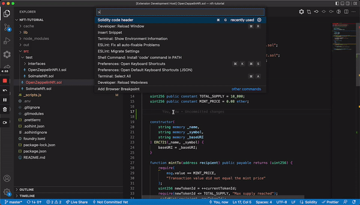

## Features

This extension allows to insert well formatted code header snippets for your solitidy code.
You can use the feature through the command palette by searching for "Solidity code header".
Alternatively you can use a key binding (`Cmd+g` on macOS or `Ctrl+g` on Windows and Linux).

### 1.0.0

Initial release of inserting formatted code comment header snippets
